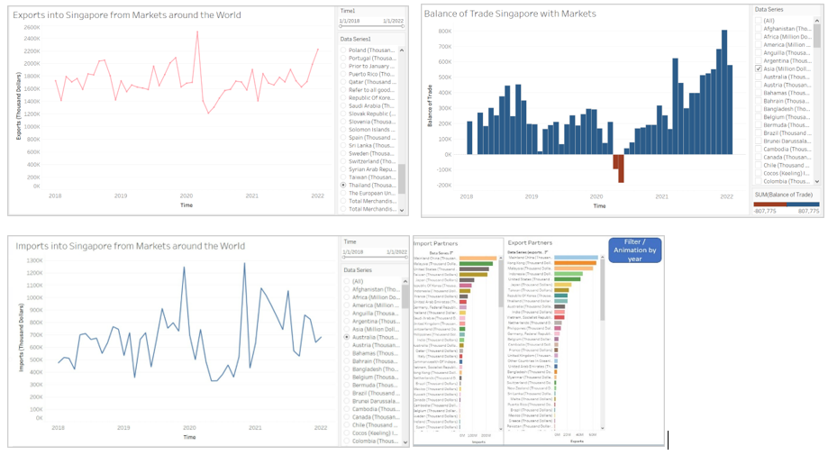

# 1. Overview

The global economy was heavily impacted in 2020 to 2021 due to the lock downs, as people saw unprecedented disruption of daily lives. Based on the World Trade organisation report press release in Oct 2021 [here]( https://www.wto.org/english/news_e/pres21_e/pr889_e.htm), the World merchandise trade volume sank below 2015 levels in Q1 2020 and this observation applied to all the countries in all regions across the globe.

Singapore trades with more than a hundred countries and is one of the most trade-dependent economy globally. As a comparatively small and open economy, movements in demand and supply will critically impact the import-export balance it has established for itself as a major trading hub.  For the past 10 years, Singapore’s trade balance (the value of exports minus the value of imports) has been in surplus, even during the COVID years in 2020 and 2021. As at 2021, the country’s major trading partner is China, followed by Hong Kong.(*[Source](https://www.mti.gov.sg/Resources/Economic-Survey-of-Singapore/2021/Economic-Survey-of-Singapore-Third-Quarter-2021): The Economic Survey of Singapore 2021*)

To study the granular details of the import and export flow of import-export markets of Singapore, the project conducts a visual analytics on the merchandise trade data released by the Department of Statistics, Singapore.

# 2. Objective

This project aims to visually analyse the merchandise trading patterns of Singapore with various markets for the time period Jan 2018 to Jan 2022 using the R-Shiny Interface. The period in this study encompasses the pandemic called COVID-19 which onset in late 2019 forcing economies to lock-down in early 2020 and then gradually opening at different times.

The objective of this project to provide meaningful insights into the merchandise trade of Singapore during the pandemic through an interactive R Shiny application. It will be useful for the policy makers to identify how pandemics affect the trade and if required make appropriate decisions for their preparedness during such times, for the corporate sector to study the trading trends for their varied use-cases such as consulting etc., and for the common folks for their knowledge and awareness. 

# 3. Data source and Overview

The Singapore Merchandise trade by Region/Markets data is available at the [website](https://www.singstat.gov.sg/find-data/search-by-theme/trade-and-investment/merchandise-trade/latest-data) of Department of Statistics, Singapore. 

A brief description of the data variables is given below:

- Market: The trading market of Singapore		

- Time: The time is given in Month-Year format.		

- Import (SGD value in Thousands): Refers to all goods brought into Singapore, irrespective of whether they are for consumption, for processing, for use in manufacturing, or for subsequent re-shipment to other countries.	

- Export (SGD value in Thousands): Refers to all goods taken out of Singapore, which includes domestic exports and re-exports. All dollar values are shown in Singapore dollars		

# 4. Proposed R Shiny App

The interface will have a Home-page containing the major insights for the users to look at quickly for their convenience. It will have a sidebar panel containing 3 tabs for the 3 types of analyses explained below.
We will explore the following visual analytic techniques to conduct the study:

1. **Descriptive Analytics**: To display the import and export volumes of Singapore with its trading partners over the years. In this section, the interface will enable the users to select the import/export market of their choice through interactive query boxes and select the time-interval they want to study through the use of sliders. Other than absolute trading volume numbers, the interface also proposes for the users to visually look the rate of change of import and export values over the time frame mentioned. Additionally, the interface will enable the users to also look the balance of merchandise trade for Singapore with these trading partners for their selected time-interval.

2. **Comparative Analysis**: This will be used as an extension of the descriptive analysis done in the first step. It will provide the users with visual aids such as slope charts and columnar line/bar plots to compare the trading volumes/rate of change in (import/export) trade for the trading partners of Singapore. The users will be able to add/remove markets they want to compare and look at across selected time-intervals.

3. **Time-Series Clustering**: The objective of this technique is to look for time series trading patterns among the trading markets of Singapore. Dynamic Time Warping (DTW) distance time-series clustering techniques will be explored along with other traditional clustering techniques such as hierarchical clustering for their suitability to this use-case. The users will have the option to select the markets to cluster along with the clustering technique of their choice, the number of clusters they want to see and also an option to select the method and distance used in clustering. The interface will also suggest the optimal number of clusters for the selected markets based on the "Elbow Method" or the "Average Silhouette Approach".

Time series clustering using Dynamic Time Warping distance and its corresponding lower bounds. Implementations of partitional, hierarchical, fuzzy, k-Shape and TADPole clustering are available. Functionality can be easily extended with custom distance measures and centroid definitions. Implementations of DTW barycenter averaging, a distance based on global alignment kernels, and the soft-DTW distance and centroid routines are also provided. All included distance functions have custom loops optimized for the calculation of cross-distance matrices, including parallelization support. Several cluster validity indices are included.

# 5. Storyboard

A view of the proposed Descriptive Analysis of Singapore's Trade Data using R Shiny app is given below.

# 6. Tools & Packages

- *Shiny*: To create the interactive shiny web application to fulfill the objectives of this project.

- *Tidyverse*: To use functions to import, tidy, manipulate and visualize the data.

- *dtwclust*: To use Dynamic Time Warping distance time-series clustering function.

- *ggthemes*: to use different theme functions for the plots.

# 7. Members

Farah Foo – [profile here](https://farahfoo.netlify.app/)

Karishma Yadav – [profile here](https://karishma-smu.netlify.app/)

Tan Yan Ru – [profile here](https://yanrutanfirstsite.netlify.app/)

# 8. References

1. [OEC website](https://oec.world/en/profile/country/sgp)
2. Economic Survey of Singapore

